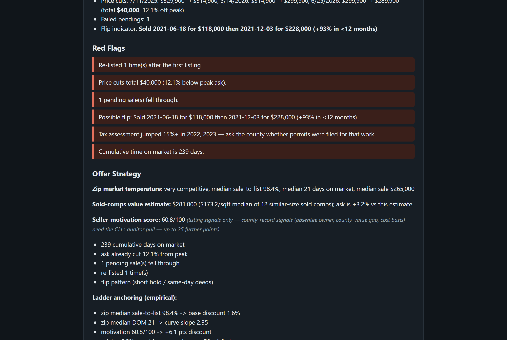
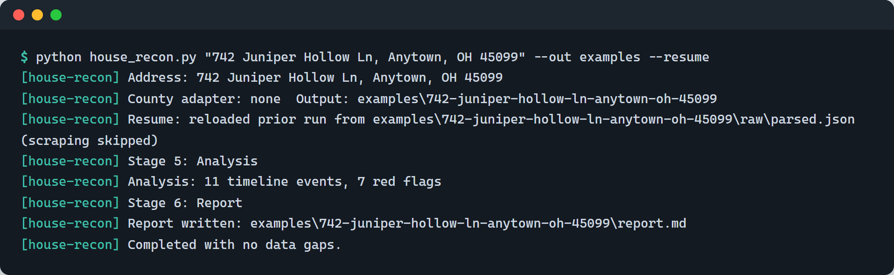

# house-recon

Automated residential real-estate due diligence for a single address — in your browser, or in one Python file.

Give it an address; it gathers the public record and produces a dated timeline, a red-flag analysis, an offer ladder with estimated acceptance odds, and a markdown report — ready for human (or AI) review.

## Use it in your browser — no install

[](https://reggie-reuss.github.io/house-recon/)

**[reggie-reuss.github.io/house-recon](https://reggie-reuss.github.io/house-recon/)** runs the analysis engine entirely client-side. Listing sites block robots, but they don't block *you* — so the pages are fetched by you, three ways (pick one):

1. **[Companion extension](extension/#install)** (Chrome/Edge, 2-minute install) — fully automatic: pick the address, click **Fetch pages automatically**, and it visits the listing, market, and sold-comps pages in your own browser, feeds them to the analyzer, and the report renders itself.
2. **Grab page bookmarklet** (no install) — drag it to your bookmarks bar once; on each page, one click scrolls, copies, and the analyzer's box fills itself when you switch back.
3. **Manual copy** (always works) — <kbd>Ctrl</kbd>+<kbd>A</kbd>, <kbd>Ctrl</kbd>+<kbd>C</kbd> on each page; the boxes auto-fill from your clipboard.

Out comes the timeline, red flags, seller-motivation score, and the empirically anchored offer ladder — rendered in the page and downloadable as Markdown. **Nothing you paste or fetch leaves your machine**; the Census address lookup is the page's only network call. A *Load demo data* button lets you try it with synthetic data first.

The browser version covers the listing-driven analysis — plus, with the free [county Worker](workers/county/) deployed, the **county auditor record** (owner, transfers merged into the timeline, value history, current taxes, an Ohio tax projection at the asking price, and a reappraisal red flag). Coverage is registry-driven and discovered by crawling whole states for supported portal platforms — 33 counties across Ohio and Indiana so far, with the live list served by the Worker's `/counties` route; see [workers/county](workers/county/). The CLI below adds what a static page can't: photo downloads, county contradiction checks, map captures, and the optional AI judgment layer.

## The CLI: full dossier

Point it at an address; it drives your locally installed Chrome headed, gathers everything, and writes the report plus a full photo index for visual review.



### Two run modes

| | Offline (default) | AI judgment layer (`--ai`) |
|---|---|---|
| Requirements | Python + Chrome. **No AI, no API key.** | Also `pip install anthropic` + Anthropic API credentials |
| Data gathering | ✅ full pipeline | ✅ same |
| Timeline, red flags, tax projection | ✅ deterministic | ✅ same |
| Offer ladder | ✅ empirically anchored when zip stats + sold comps are captured (heuristic fallback) | ✅ same **plus** AI-refined ladder with per-rung rationale |
| Photo review | Photo index + fill-in-the-blank checklist | ✅ per-photo condition notes, defects, answered checklist |
| Work items & costs | manual | ✅ itemized with urgency + cost ranges |
| Verdict | manual | ✅ negotiation points + bottom-line verdict |

The AI mode uses the official [Anthropic Python SDK](https://github.com/anthropics/anthropic-sdk-python) (default model `claude-opus-5`) with structured JSON-schema outputs — swap models with `--ai-model`. Credentials resolve from `ANTHROPIC_API_KEY`, `ANTHROPIC_AUTH_TOKEN`, or an `ant auth login` profile. Already ran a house offline? Add the AI pass without re-scraping:

```bash
python house_recon.py "123 Main St, Anytown, OH 45000" --out reports --resume --ai
```

## What it does

- **Zillow listing pull** — facts, description, price history, and tax history for the address.
- **Full-resolution photo download** — every listing photo, saved locally for visual condition review (roof, grading, water staining, deferred maintenance, staging tricks).
- **County auditor record** — owner, transfer history, dwelling card, value history, tax rates and distribution, and permits. A **Butler County, OH** adapter is included; other counties can be added (see [Extending](#extending)).
- **Google Maps captures** — satellite and street-view screenshots for lot context, neighboring properties, and roofline checks.
- **Merged timeline** — listing events, transfers, value changes, and permits interleaved into one dated history.
- **Red-flag analysis** — automatically computed:
  - price cuts and relists
  - failed pendings
  - flip patterns (short hold + resale markup)
  - assessment jumps without matching permits
  - listing-vs-county contradictions (beds, baths, square footage, year built)
  - Ohio property-tax projections after reappraisal at the pending sale price
- **Offer strategy** — a seller-motivation score (0–100) from documented signals (days on market, cuts, failed pendings, relists, absentee owner, county-value gap, cost basis) mapped to an offer ladder: 4 rungs with estimated acceptance odds and expected savings. Works fully offline.
- **Empirical anchoring** — the ladder anchors to *observed* data when it can get it: the zip's median sale-to-list ratio and days on market (scraped from the Redfin housing-market page) set the base discount and curve slope, and a sold-comps value estimate (median $/sqft of the zip's last-6-months sales, similar size/beds preferred) shifts the curve by the ask-vs-value gap. The report labels the anchoring mode (`empirical` / `comps-adjusted` / `heuristic`) and shows the math. Still calibrated estimates — not a fitted statistical model.
- **AI judgment layer (optional, `--ai`)** — a Claude vision pass over every downloaded photo (condition notes + defects per photo), then a synthesis pass over the whole dossier: condition grade, work items with urgency and cost ranges, answered visual checklist, an AI-refined offer ladder with evidence-based rationale per rung, negotiation points, and a bottom-line verdict.
- **Report skeleton** — a markdown report with the data filled in and a photo index; in offline mode the visual-review sections are structured for a person or an LLM to complete, in `--ai` mode they arrive completed.

house-recon collects and organizes; it does not replace an inspection, a title search, or an agent. See [METHODS.md](METHODS.md) for the full due-diligence methodology, including techniques not yet automated.

**See a complete sample report:** [examples/742-juniper-hollow-ln-anytown-oh-45099/report.md](examples/742-juniper-hollow-ln-anytown-oh-45099/report.md) — a synthetic demo (fictional address and data, generated by [`examples/make_demo.py`](examples/make_demo.py)) built to trip every analysis feature: flip detection, failed pending, relist, price cuts, unpermitted-renovation signal, absentee owner, a listing/county contradiction, and the empirically anchored offer ladder.

## Why headed Chrome

house-recon uses [Playwright](https://playwright.dev/python/) to drive your **real, locally installed Chrome — headed, by default**. Listing and mapping sites tolerate a genuine browser session far better than headless HTTP scraping: you get real rendering, real cookies, and far fewer blocks and CAPTCHAs. You will see a browser window open and navigate; that is expected.

## Install

Requires **Python 3.10+** and a system install of **Google Chrome or Microsoft Edge** (no separate browser download needed).

```bash
pip install -r requirements.txt
```

Optional fallback, if you have neither Chrome nor Edge installed:

```bash
python -m playwright install chromium
```

Optional, only for the AI judgment layer:

```bash
pip install anthropic
# then set ANTHROPIC_API_KEY, or run `ant auth login`
```

## Usage

```bash
python house_recon.py "123 Main St, Anytown, OH 45000" --out reports
```

### Flags

| Flag | Default | Description |
| --- | --- | --- |
| `--out DIR` | `reports` | Output directory root. Each run writes to `DIR/<address-slug>/`. |
| `--county NAME` | auto | County adapter to use. Auto-detected from the address when possible; `butler-oh` is the adapter shipped today. |
| `--headless` | off | Run the browser headless. Expect more blocks; headed is the supported mode. |
| `--skip-photos` | off | Skip downloading listing photos. |
| `--skip-maps` | off | Skip Google Maps satellite/street-view captures. |
| `--skip-county` | off | Skip the county auditor pull (useful outside supported counties). |
| `--skip-trulia` | off | Skip the Trulia cross-reference stage. |
| `--zillow-url URL` | auto | Explicit Zillow `/homedetails/` URL, if the address search lands wrong. |
| `--resume` | off | Skip scraping; reload `raw/parsed.json` + photos from this address's previous run (e.g. to add `--ai` after the fact). |
| `--skip-market` | off | Skip the zip market-temperature and sold-comps stages. |
| `--refresh-market` | off | With `--resume`: re-scrape only the zip market stats + sold comps (light browser session). |
| `--ai` | off | Enable the Claude judgment layer (photo review, work items, refined offer ladder, verdict). Needs `pip install anthropic` + credentials. |
| `--ai-model MODEL` | `claude-opus-5` | Claude model for the judgment layer. |
| `--ai-photos N` | 30 | Max photos sent for AI review. |
| `--ai-batch N` | 10 | Photos per vision request. |

Run `python house_recon.py --help` for the authoritative list.

## Output layout

```
reports/
└── 123-main-st-anytown-oh-45000/
    ├── report.md        # report skeleton: facts, timeline, red flags, photo index
    ├── photos/          # full-resolution listing photos
    ├── maps/            # satellite + street-view screenshots
    └── raw/             # raw captured data (JSON/HTML) for reproducibility
```

## IMPORTANT: privacy note

The `reports/` directory is **gitignored by design**. Analysis output contains street addresses, owner names, and transaction details for real people. Keep your personal reports out of any public fork — do not weaken the `.gitignore` rule, and do not commit report output to a repository others can see.

## Extending

Adding support for your county's auditor portal means implementing a small adapter with two responsibilities:

1. **Search** — given an address (or parcel number), navigate your county's portal and land on the property record page.
2. **Parse** — extract owner, transfer history, dwelling card, value history, tax rates/distribution, and permits into the common record structure the Butler County, OH adapter produces.

Use the Butler County adapter in `house_recon.py` as the reference implementation. County portals vary wildly (some are Vision, some Tyler, some homegrown), so adapters are intentionally self-contained. **PRs welcome.**

Two more places contributions land:

- **The browser analyzer** ([docs/](docs/)) is a dependency-free static page; [`docs/recon.js`](docs/recon.js) is a line-for-line port of the Python parsers and analysis functions. `house_recon.py` is the reference implementation — if you change a parser or the offer engine, update both. New county adapters can also register their FIPS code in `docs/app.js` (`CLI_COUNTY_ADAPTERS`) so the address lookup advertises them.
- **The synthetic demo** regenerates with `python examples/make_demo.py`, which rebuilds both the sample report and the web app's demo data from one source of truth.

## Methodology

See [METHODS.md](METHODS.md) for the full due-diligence methodology this tool is built around, including manual techniques that are not yet automated.

## Validation

The market-temperature and sold-comps stages were tested against **3 zip codes in all 50 states** (150 zips, ~330 live page loads): 100% market-stats coverage, 94.7% sold-comps coverage, and 96.5% cross-source consistency on recent-sale price levels (median agreement within ~6%). The campaign surfaced and fixed two real parser bugs (a $2M cap that erased luxury markets; counties that don't publish square footage) and mapped where the anchors are structurally weak (non-disclosure states, condo/rowhouse-dominant zips). Full methodology, findings, and the rerunnable harness: [VALIDATION.md](VALIDATION.md).

## Disclaimer

house-recon is informational tooling, not professional advice. It is not an inspection, an appraisal, a title search, or legal or financial guidance. Offer-ladder acceptance odds — heuristic or AI-refined — are calibrated estimates from public listing signals, not predictions; real acceptance depends on comps, market temperature, and the seller's situation. Respect the terms of service of the websites you access with it. Verify anything that matters with licensed professionals — inspectors, agents, attorneys, and your county's offices.

## License

[MIT](LICENSE)
