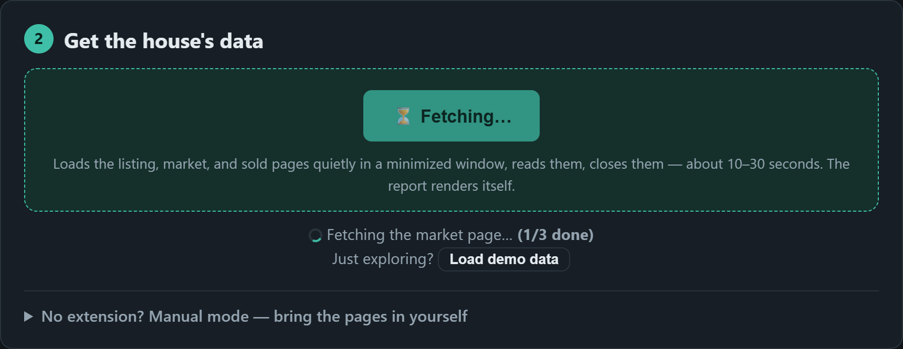

# house-recon companion extension

A tiny browser extension (Chrome / Edge / Brave, Manifest V3) that removes the
copy-paste step from the [browser analyzer](https://reggie-reuss.github.io/house-recon/):
type an address, click **Fetch pages automatically**, and the extension visits
the listing, the zip's market page, and the sold-comps search **in your own
browser**, hands their text to the analyzer page, and the report renders.

## Why an extension (and not a server)

Listing sites aggressively block scraping servers, but they serve normal
visitors happily. The extension keeps the analyzer's core property — *you*
visit the pages, with your own browser, cookies, and IP — while automating the
"open, scroll, copy" busywork. Pages load **quietly in a minimized window**
(the analyzer page shows a live per-page progress counter while they do), and
the window only comes to the front when a site wants a human check. It is the
CLI's headed-Chrome philosophy, minus the CLI.

## Privacy

- Does nothing until the analyzer page asks it to fetch. No browsing history
  access, no tracking, no analytics, no network calls of its own.
- Page text goes straight from the visited tab to the analyzer page in your
  browser. Nothing is uploaded anywhere.
- Host permissions are limited to `zillow.com`, `redfin.com`, and
  `localhost` (for local development). The bridge runs only on the analyzer
  page itself.

## Install

One click from the stores:

- **[Chrome Web Store](https://chromewebstore.google.com/detail/house-recon-companion/hfeipempelbcdegkngoibcbfihpnadfm)** (Chrome, Brave, and other Chromium browsers)
- **[Edge Add-ons](https://microsoftedge.microsoft.com/addons/detail/pcjimembldibfmigkhcpbpgfjlkoncdj)**

Then open (or reload) the [analyzer page](https://reggie-reuss.github.io/house-recon/) —
step 2 shows **⚡ Fetch pages automatically**.

Developer install (load unpacked)

1. Download this repository ([ZIP](https://github.com/Reggie-Reuss/house-recon/archive/refs/heads/main.zip))
   and unzip it — or `git clone` it.
2. Open `chrome://extensions` (Edge: `edge://extensions`).
3. Turn on **Developer mode** (top-right toggle).
4. Click **Load unpacked** and select the `extension/` folder.

## Use

1. On the analyzer page, do step 1 (Find address).
2. Click **Fetch pages automatically**. The pages load, scroll, and close in
   a minimized window — about 10–30 seconds for all three, with a live page
   counter in the analyzer's status area.
3. The report renders on its own when the listing parses. If the zip turns up
   fewer than 5 sold comps in 6 months, the extension automatically re-fetches
   the 1-year sold window to firm up the value estimate.

If a site shows a human check ("Press & Hold"), the window comes to the front
and waits for you — complete the check (you're a real visitor, it passes),
then click **Fetch pages automatically** again.

## Known limitations

- The listing URL is resolved through Zillow's address suggester, so
  off-market homes and accounts with saved Zillow search filters work. If the
  suggester doesn't know the address at all, the fetch falls back to Zillow's
  address-search URL, which can land on a results page — open the listing
  yourself and use the Grab page bookmarklet or Ctrl+A / Ctrl+C for that one
  box.
- Firefox needs an MV3 port (event page instead of service worker) — not done
  yet.

## Publishing to stores (maintainer notes)

The extension is live on both stores (links above). To ship an update: bump
the version in `manifest.json`, build the store zip with `build.ps1` (it
strips the dev-only localhost permissions), and upload it in both developer
consoles. Field-by-field submission walkthroughs — including permission
justifications and screenshot requirements — live in
[STORE_LISTING.md](STORE_LISTING.md); the stores' privacy policy is
[PRIVACY.md](PRIVACY.md).
